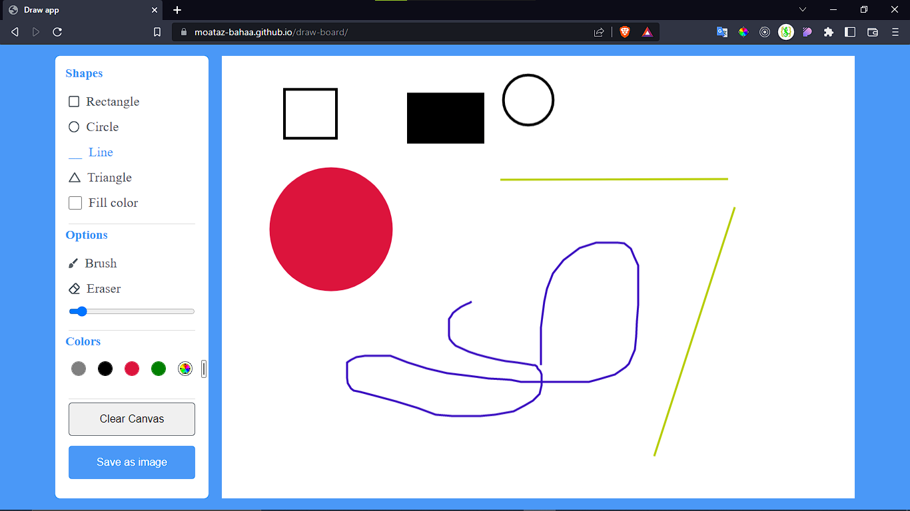

# draw board application
it's a simple draw application based on html canvas element
user can select a color and draw a circle, rectangle, triangle, line or use a brush to
draw what ever he/she wants
als user can erase what he drawed using eraser and control eraser and brusher size

## scrren

